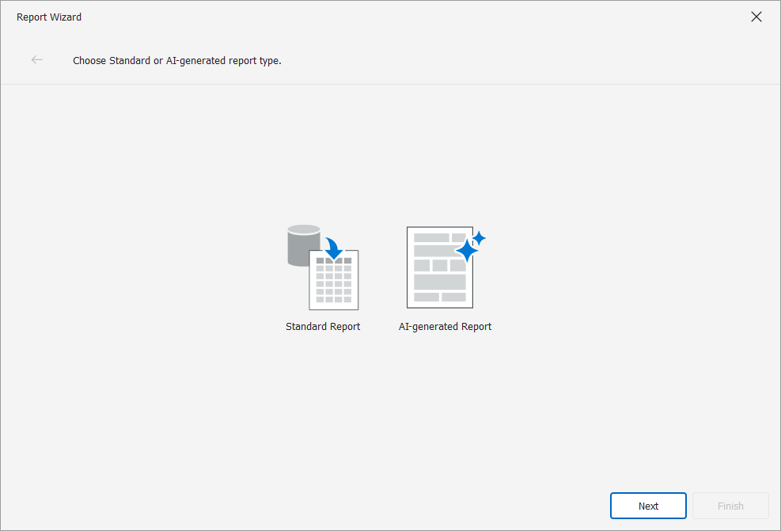

# WinForms Reporting – Add AI-powered Options to the DevExpress Report Wizard and Customize the First Page 

You can add AI-powered report generation options to the DevExpress Report Wizard by:  

Registering the [ReportPromptToReportBehavior](https://docs.devexpress.com/XtraReports/DevExpress.AIIntegration.WinForms.Reporting.ReportPromptToReportBehavior?v=25.1&p=netframework) extension. This approach adds predefined AI-related pages to the Report Wizard. This also means that the Wizard uses a predefined first page and overrides any customizations you may have implemented for this page. Refer to the following BC for additional information: Report Wizard - [Report Wizard - "Choose a Report Type" page customization option is disabled when you create reports with an AI-powered Extension (ReportPromptToReportBehavior)](https://isc.devexpress.com/internal/ticket/details/t1290568).

Creating and registering your AI-powered Report Wizard manually. This approach allows you to incorporate AI options within the Wizard and customize associated pages as needs dictate. 

This example uses the second option. The `ChooseReportCreationModePage` page overrides the Report Wizard start page and allows users to select an AI-powered report generation option. The page contains two options: Standard Report and AI-generated Report. The code also registers required pages with AI-related options.  



Select **Standard Report** and then [Choose a Report Type](https://docs.devexpress.com/XtraReports/117397/visual-studio-report-designer/report-wizard/choose-a-report-type). This page allows you to create the following report types: 

* Blank Report
* Table Report
* Vertical Report
* Cross-Tab Report
* Labels
* Template
* Inherited Report

Select **AI-generated Report** and then **Select a Data Source Option**. This page works with two data source options: 

* No Data Source

    Creates a report structure based on a user’s natural language description. 

* Add Data Source

    Allows users to create a report data source in the first step, displays the data source structure in the Report Wizard interface, and automatically includes this metadata in the LLM prompt. Users can reference available data source fields when they describe data-bound report elements. 

## Implementation Details

### Create a New Page

The following classes identify a custom Report Wizard page: 

* **File to review:**: [ChooseReportCreationModePageView](./CS/Customization/ChooseReportCreationModePageView.cs)

    `ChooseReportCreationModePageView` identifies a custom page view (a `WizardViewBase` descendant that implements `IChooseReportCreationModePageView`). `ChooseReportCreationModePageView` defines page GUI elements such as "Standard Report" and "AI-generated Report" items, text header, and other elements. 

* **File to review:**: [IChooseReportCreationModePageView](./CS/Customization/IChooseReportCreationModePageView.cs)

    Interface for a custom page implemented via `ChooseReportCreationModePageView`.  

* **File to review:**: [ChooseReportCreationModePage](./CS/Customization/ChooseReportCreationModePage.cs)    

   `ChooseReportCreationModePage` identifies a page presenter (`WizardPageBase<TView, TModel>` descendant). AI-generated `ChooseReportCreationModePage` defines the logic used to navigate to the next page based on the selected item. 

### Implement a Customization Service 

**File to review:** [WizardCustomizationService](./CS/Customization/WizardCustomizationService.cs)

WizardCustomizationService implements the IWizardCustomizationService interface. This interface exposes methods and allows you to register custom Report Wizard page content and obtain Wizard-related resources. 

The following pages are registered:

|View|Presenter|
|---|---|
|ChooseReportCreationModePageView|ChooseReportCreationModePage|
|AIChooseDataSourceOptionPageView|AIChooseDataSourceOptionPage|
|AINoDataEnterReportPromptPageView|AINoDataEnterReportPromptPage|
|AIDataBoundEnterReportPromptPageView|AIDataBoundEnterReportPromptPage|

* `SetAIParameters()` - initializes default values for AI settings. 

* `SetPredefinedAIReportPrompts()` - adds built-in DevExpress prompts from `AIReportPromptCollection` to the Report Wizard. 

## Use the Report Builder 

**File to review:** [WizardCustomizationService](./CS/Customization/WizardCustomizationService.cs)

Use [AIReportBuilder](https://docs.devexpress.com/XtraReports/DevExpress.AIIntegration.WinForms.Reporting.Wizard.AIReportBuilder?v=25.1&p=netframework) to build an AI-generated report based on the resulting report model.  #

## Register AI Client

DevExpress does not provide a REST API nor include built-in LLMs/SLMs. To use AI services, you need an active Azure/OpenAI subscription to obtain the necessary REST API endpoint and key. This information must be provided at application startup to register AI clients and enable DevExpress AI-powered Extensions. 

**File to review:** [Program.cs](./CS/Program.cs)

Specify your credentials in the following code:

    ```
    static string AzureOpenAIEndpoint { get { return "AZURE_OPENAI_ENDPOINT"; } }
    static string AzureOpenAIKey { get { return "AZURE_OPENAI_APIKEY"; } }
    static string DeploymentName { get { return "gpt-4o-mini"; } }
    [STAThread]
    static void Main(){
        IChatClient client = new AzureOpenAIClient(
            new Uri(AzureOpenAIEndpoint),
            new ApiKeyCredential(AzureOpenAIKey))
                .GetChatClient(DeploymentName).AsIChatClient(); 
        AIExtensionsContainerDesktop.Default.RegisterChatClient(client);
    ```    


For information on AI Client registration, refer to the following section in our AI Integration help topic: [Register AI Clients](https://docs.devexpress.com/WindowsForms/405151/ai-powered-extensions?v=25.1#register-ai-clients).


